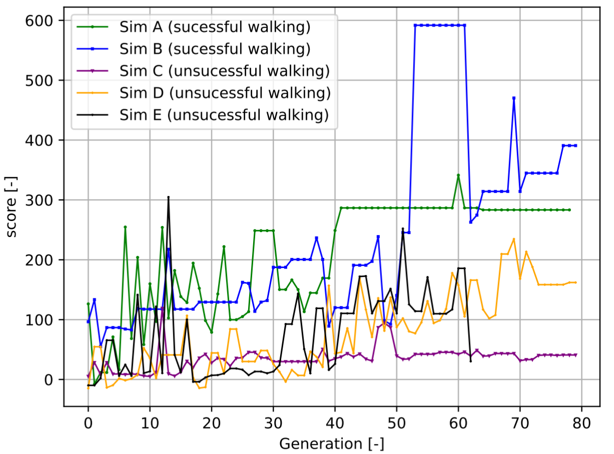

# Report support file
This file is used to compliment the results of the report by providing visual references to the simulation results in gif format

- [Report support file](#report-support-file)
  * [Performance evaluation ](#performance-evaluation--a-name--pe----a-)
    + [Training rules ](#training-rules--a-name--pe-t----a-)
    + [Results ](#results--a-name--pe-r----a-)
  * [Training of Bipedal controller ](#training-of-bipedal-controller--a-name--bc----a-)
    + [Training rules ](#training-rules--a-name--bc-t----a-)
    + [Results ](#results--a-name--bc-r----a-)
    + [Additional Results ](#additional-results--a-name--bc-ar----a-)

## Performance evaluation 
In order to verify the NeatAI is capable of correctly achieving neuroevolution and converging to a specific solution, a test was made to see if it could obbey 3 simple rules in training a network on a arbitrary run

### Training rules 
  - Position restriction: The network is **penalized** for the distance of the current torso position to the original/upright torso position (only in the z axis)
  - Rotation restriction: The network is **penalized** for the rotation of the torso in relation to the uppright position (x axis)
  - Velocity restriction: The network is **penalized** for any torso velocity

### Results 
- gen 1 through 3

-gen 22 and 23 (mid training)

-last/best gen (gen = 57)

- other results
score graph over the generations, showing max, min and average score for the entire population and phenotype of the last network

  
   

## Training of Bipedal controller 
Training the algorithm to walk is a challenge since walking requires the network to purposely lose balance (forwards) and use the legs in a coordinated manner to maintain temporary balance. 

### Training rules 
  - Distance travelled incentive: The network is given points for the y distance it travelled 
    - EXCEPTIONS: The network does NOT gain points if it was travelling upside down
    - EXCEPTIONS: The network does NOT gain any additional points for any distance travelled with legs that haven't cycled for more than 150 simulation steps

  - Leg cycling: The network is rewarded for cycling its legs in the correct direction, every simulation step, a point is deducted to deter stagnation in the leg movement

  '''python

    #Right leg case
    #if leg is behind the target, the velocity should be positive
                  #current R dir stores the target velocity direction of the right leg
                  #1 is forwards, -1 is backwards
                  if current_R_dir == 1:
                      #intermediate_pos_R has 20 "checkpoints" until the target position
                      #the if the right leg crosses a checkpoint, the checkpoint is removed
                      #and 3 points are added
                      while R_leg_pos > intermediate_pos_R[0]:
                          intermediate_pos_R.pop(0)
                          Leg_correct_vel_counter += 3
                          if len(intermediate_pos_R) == 0:
  '''
                
  - EXCEPTIONS: If the network is upside down, the network does not gain any points and is severelly penalized every simulation step
    

### Results 
6 Simulations were run for this algorithm under these training rules, of which 2 managed to displayed human walking patterns, 3 converged to random solutions and 1 converged to a skipping pattern

- Best simulation (Sim B)

  
   
   
   

- Alternative sucessful simulation (Sim A)

- Other simulations that converged to random results (Sim C, D and E)

  
   
   

- Convergence data and phenotype of the resulting networks

  - Phenotype of best network of Sim A (input-output direct connections hidden for readability)
  

  - Phenotype of best network of Sim B (input-output direct connections hidden for readability)
  
     
### Additional Results 

As mentioned, one other result of this training was skipping, which was achieved by simply increasing the simulation step counter from 150 simulation steps to 250 simulation steps

